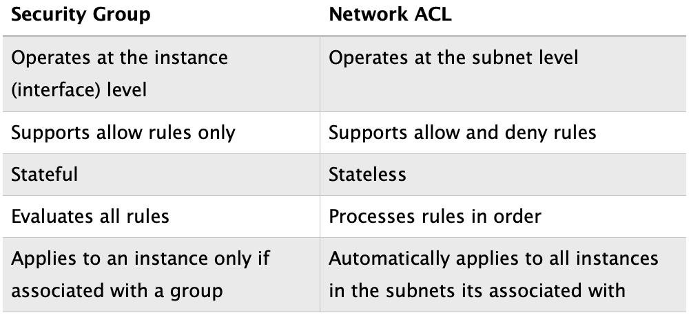

## **Common/important questions**; add practice exam answers to their relevent sections in notes.

 
misc,3,4,5,6,7,8,9,10 
 
11,12,13,14,15,16,21,17,18 ===========
 

 

-------------------------------------------------

 

- ### **AWS Trusted Advisor** = Real-time guidance to help provision your resources following AWS best practices; Helps optimize...
	- 	Cost
	-	Security
	-	Fault tolerance
	-	Performance

 

- ### **Sole responsibility of AWS**
	- Availability Zone Management

 

- ### **Prohibited uses of the web services offered by Amazon Web Services**
	- AWS Acceptable Use Policy

 

- ### **AWS to offer lower pay-as-you-go pricing for thousands of customers**
	- Massive economies of scale

 

- ### **Cloud advantages**
	- Increase speed and agility
	- No cost for data center maintenance
	- Stop guessing capacity
	- Trade capital/fixed expenses for variable expenses

 

- ### **Free services**
	- IAM
	- Auto scaling

 

- ### **Services you can reserve for discounts**
	- EC2
	- RDS
	- DynamoDB
	- RedShift
	- ElastiCache

 

- ### **Automatically enabled Data Encryption**
	- AWS Storage Gateway
	- S3 Glacier

 

- ### **Central user portal to log into third-party business applications**
	- AWS Single Sign-On (SSO)

 

- ### **Security Group vs Network ACL**

 

- ### **AWS Support Plans**
	## **Basic** – Forums support.
	## **Developer** – Business hours email support.
	## **Business** – 24/7 email, chat, and phone support.
	## **Enterprise** – 24/7 email, chat, and phone support.

### - Developer allows one person to open unlimited cases.
### - Enterprise comes with a Technical Account Manager (TAM).
### - Business and Enterprise allow unlimited contacts to open unlimited cases.

 